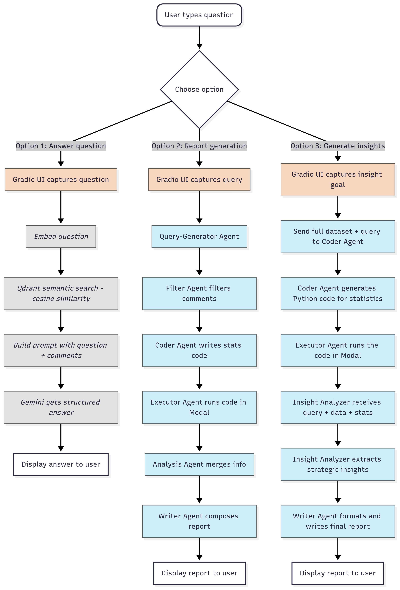

# 🧠 System Definition

This system is a **Q&A chatbot** with two main functionalities:

1. **Social Media Insights**  
   - Analyzes social media comments in **Darija** (Moroccan dialect) about **snacks and drinks**.  
   - Uses **embeddings**, **vector search**, and **Gemini** to answer **insight-based questions**.

2. **Multi-Agent Reporting**  
   - A **Multi-Agent System** processes both the **data** and the **user’s query**.  
   - Automatically generates a **structured report** with insights.

---

# 🔄 Data Flow

  

